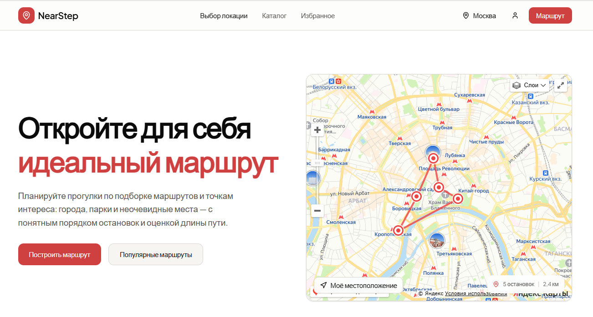
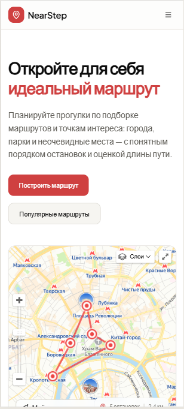

# Отчет о разработке

## Frontend (HW4)

### Описание процесса разработки

В процессе разработки использовались следующие техники работы с AI:

- использование v0.app для генерации шаблона сайта и промптов
- использование playwright для генерации автотестов
- использование cursor для генерации кода

### Примеры промптов и результатов

#### Для генерации шаблона сайта использовался v0.app и промпт:

```prompt
Создай шаблон сайта для туристического сервиса по требованиям из файла @project_description.md и @technical-specification.md
```

[project_description.md](../analytics/project_description.md)
[technical-specification.md](../analytics/technical-specification.md)

#### Для генерации автотестов использовался playwright со скиллом playwright-expert и промпт:

[create-autotests.md](../prompts/create-autotests.md)

---

## Backend и интеграция (HW5)

### Архитектурное решение

Выбран **Supabase (BaaS)** + собственный **Fastify API** для OSM-провайдеров, кэша и построения маршрутов. Подробности — в [backend_documentation.md](../backend_documentation.md).

### Этапы разработки с AI

| Этап | Промпт | Результат |
|------|--------|-----------|
| 0 | [prompt_stage0_prereqs.md](../prompts/prompt_stage0_prereqs.md) | Чеклист Supabase, env, SQL |
| 1 | [prompt_stage1.md](../prompts/prompt_stage1.md) | Каркас backend: Fastify, healthcheck, структура слоёв |
| 2 | [prompt_stage2.md](../prompts/prompt_stage2.md) | SQL-миграция `favorites` + `provider_cache`, RLS |
| 3 | [prompt_stage3.md](../prompts/prompt_stage3.md) | Nominatim, Overpass, cache-aside в `provider_cache` |
| 4 | [prompt_stage4.md](../prompts/prompt_stage4.md) | `POST /api/routes/build`, `core/route-builder` |
| 5 | [prompt_stage5.md](../prompts/prompt_stage5.md) | JWT middleware (JWKS), favorites repo и routes |
| 6 | [prompt_stage6.md](../prompts/prompt_stage6.md) | `HttpNavigatorDataSource`, удаление mock, auth UI |
| 7 | [prompt_stage7.md](../prompts/prompt_stage7.md) | Playwright: два webServer, OSM mock для CI |

### Примеры промптов (HW5)

**SQL-схема и RLS:**

```prompt
Подготовить SQL для Supabase: таблицы favorites (user_id, type, payload jsonb)
и provider_cache (cache_key, response, expires_at). Включить RLS на favorites
с policies SELECT/INSERT/DELETE только для auth.uid() = user_id.
```

**OSM-провайдеры и кэш:**

```prompt
Реализовать GET /api/locations/search и GET /api/pois?by=nearby с cache-aside:
сначала provider_cache, при miss — Nominatim/Overpass, затем save с TTL.
Добавить zod-валидацию query params и mock-режим для CI.
```

**Интеграция frontend:**

```prompt
Заменить mock NavigatorDataSource на HTTP-клиент к backend.
При логине синхронизировать localStorage избранное через POST /api/favorites/sync.
Добавить UI входа/регистрации через Supabase Auth.
```

### Проблемы и решения (HW5)

| Проблема | Решение (с помощью AI) |
|----------|------------------------|
| E2e зависели от нестабильного Overpass | OSM mock при `CI=true` / `OSM_MOCK=1` в backend |
| Backend не стартует без Supabase env | Документирован prerequisite; zod-валидация env при старте |
| Избранное гостя терялось при логине | `POST /api/favorites/sync` + очистка localStorage после sync |
| JWT на backend | Проверка через JWKS (`jose`), не через user_metadata |
| Playwright поднимал только frontend | Два `webServer` в playwright.config.ts |

---

## Скриншоты





## Общие заметки

- Для отображения карты на GitHub Pages используется iframe с Яндекс Картами.
- В репозитории правило Cursor: перед push запускать `npm run test:e2e`.
