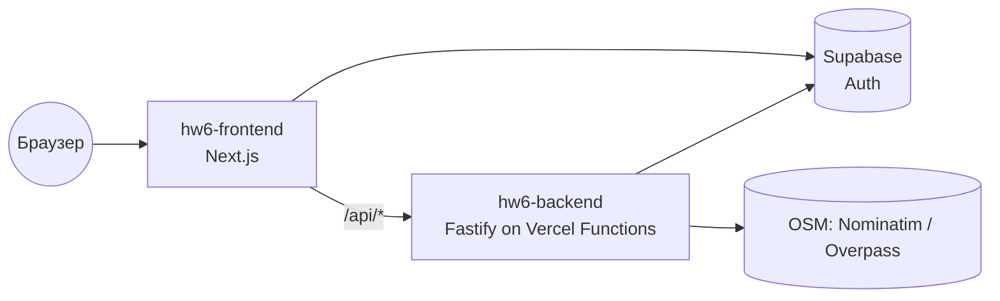
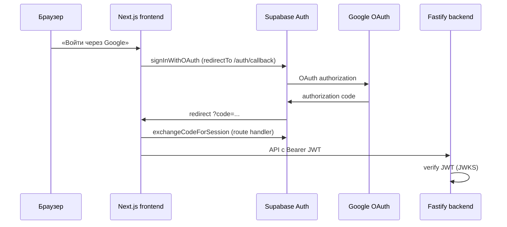
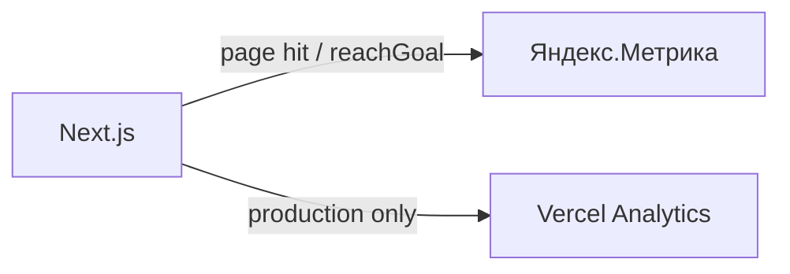
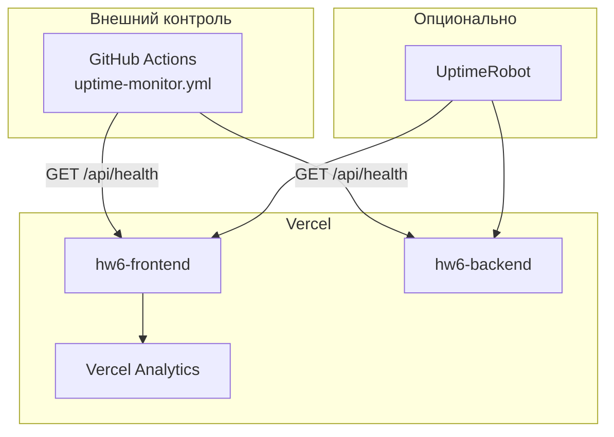
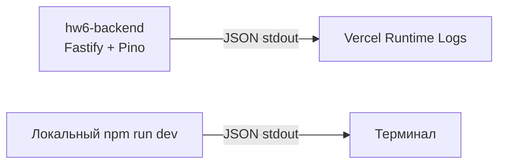

# Документация по интеграциям и деплою (HW6)

> Документ ведётся по мере выполнения шагов задания. Текущий охват: **Шаг 1 — CI/CD**, **Шаг 2 — безопасность**, **Шаг 3 — OAuth2**, **Шаг 4 — аналитика**, **Шаг 5 — пропущен (опционально)**, **Шаг 6 — мониторинг**, **Шаг 7 — логирование**.

## Технологический стек

- **Frontend**: Next.js (App Router) + React + TypeScript, Tailwind CSS + shadcn/ui. Папка `frontend/`.
- **Backend**: Fastify + TypeScript. Папка `backend/`.
- **БД / Auth**: Supabase.
- **E2E**: Playwright (корень репозитория, `npm run test:e2e`).

## Архитектура деплоя

Оба приложения деплоятся на **Vercel** (Hobby, без карты) как два отдельных проекта из одного репозитория:

| Проект | Root Directory | URL |
|--------|----------------|-----|
| `hw6-frontend` | `frontend` | https://hw6-pi-ruddy.vercel.app |
| `hw6-backend` | `backend` | https://hw6-ac72.vercel.app |

БД и аутентификация — в Supabase.



## CI/CD

### CI — GitHub Actions

Файл: `.github/workflows/ci.yml`. Триггеры: push и PR в `main`.

| Job | Шаги |
|-----|------|
| `quality` | `Prettier --check` (весь код) + `ESLint` (frontend) + `npm audit --audit-level=high` (frontend, backend) |
| `frontend` | `npm ci` → `npm run typecheck` → `npm run build` |
| `backend` | `npm ci` → `npm run typecheck` → `npm run build` |
| `e2e` | Playwright (chromium) с `OSM_MOCK=1`; зависит от `quality`, `frontend`, `backend`; запускается только при наличии секретов |

Проверки качества кода:
- **Форматирование** — Prettier (`npm run format:check`, конфиг `.prettierrc.json`).
- **Линтинг** — ESLint для фронтенда (`npm run lint`, `eslint-config-next/core-web-vitals`).
- **Типизация** — `tsc --noEmit` для фронта и бэка + production build.

### CD — Vercel

Автодеплой при изменении ветки `main`: Vercel пересобирает оба проекта.

> **Важно (Git Author Protection):** Vercel собирает только коммиты, автор которых — участник аккаунта Vercel. Поэтому деплой происходит при **мерже PR в `main`** (merge-коммит владельца). Прямые push от стороннего git-автора Vercel помечает как `BLOCKED`.

#### Backend на Vercel (Fastify)

Fastify запускается не как «слушающий порт» сервер (в serverless это приводит к таймауту 504), а через явный обработчик:

- `backend/src/app.ts` — `buildApp()` собирает Fastify без `listen()`.
- `backend/src/index.ts` — локальный/обычный запуск: `buildApp()` + `listen()`.
- `backend/api/index.ts` — функция Vercel: `app.ready()` + `app.server.emit("request", req, res)`.
- `backend/vercel.json` — `framework: null`, rewrite всех путей на `/api`.

#### Переменные окружения

**hw6-backend:**

| Переменная | Значение |
|------------|----------|
| `CORS_ORIGIN` | URL фронта (например `https://hw6-pi-ruddy.vercel.app`) |
| `SUPABASE_URL` | URL проекта Supabase |
| `SUPABASE_SERVICE_ROLE_KEY` | service role ключ (только backend) |
| `SUPABASE_JWKS_URL` | `https://<ref>.supabase.co/auth/v1/.well-known/jwks.json` |
| `HOST` | на Vercel выставляется в `0.0.0.0` автоматически (`process.env.VERCEL`) |

`PORT` Vercel прокидывает сам. `CORS_ORIGIN` нормализуется в коде (убирается хвостовой `/`, поддерживается список через запятую).

**hw6-frontend:**

| Переменная | Значение |
|------------|----------|
| `NEXT_PUBLIC_SUPABASE_URL` | URL проекта Supabase |
| `NEXT_PUBLIC_SUPABASE_ANON_KEY` | публичный anon-ключ |
| `NEXT_PUBLIC_BACKEND_URL` | URL бэкенда (`https://hw6-ac72.vercel.app`) |
| `NEXT_PUBLIC_YM_COUNTER_ID` | Номер счётчика Яндекс.Метрики (опционально; без него Метрика не загружается) |

URL бэкенда резолвится через `frontend/lib/backend-url.ts`: приоритет у `NEXT_PUBLIC_BACKEND_URL`, иначе — прод-fallback.

## Статус (Шаг 1)

- CI (GitHub Actions): jobs `frontend`, `backend`, `e2e` настроены.
- Секреты для E2E добавлены в репозиторий (Settings → Secrets and variables → Actions).
- Локальный прогон E2E: **19/19 passed** (`OSM_MOCK=1`).
- Прод задеплоен: фронт `hw6-pi-ruddy.vercel.app`, бэкенд `hw6-ac72.vercel.app`.

## Статус (Шаг 2)

- Аудит зависимостей и кода выполнен, отчёт в `security_audit.md`.
- Исправления: headers, rate-limit, валидация, Next.js 16.2.9.
- E2E: **19/19 passed** локально.

## OAuth2 (Шаг 3)

Провайдер: **Google** через **Supabase Auth** (PKCE, state — встроены в Supabase).

### Архитектура



- **Frontend**: `signInWithOAuth`, callback `frontend/app/auth/callback/route.ts`, кнопка в диалоге входа.
- **Backend**: не обменивает code на token (это делает Supabase); проверяет выданный JWT и отдаёт профиль `GET /api/auth/me`.
- **Email/пароль** — сохранён как альтернативный способ входа.

### Настройка (один раз)

#### 1. Google Cloud Console

1. [Google Cloud Console](https://console.cloud.google.com/) → APIs & Services → Credentials → Create OAuth client ID (Web application).
2. **Authorized JavaScript origins**: `http://127.0.0.1:3000`, `https://hw6-pi-ruddy.vercel.app`.
3. **Authorized redirect URIs**: `https://zparhjgdxiipsxoijkga.supabase.co/auth/v1/callback` (URL Supabase callback, не фронтенда).
4. Скопировать **Client ID** и **Client Secret**.

#### 2. Supabase Dashboard

1. Authentication → Providers → **Google** → Enable, вставить Client ID/Secret.
2. Authentication → URL Configuration:
   - **Site URL**: `https://hw6-pi-ruddy.vercel.app`
   - **Redirect URLs** (добавить):
     - `http://127.0.0.1:3000/auth/callback`
     - `https://hw6-pi-ruddy.vercel.app/auth/callback`

Переменные Vercel для OAuth **не нужны** — ключи хранятся в Supabase. На фронте достаточно `NEXT_PUBLIC_SUPABASE_*`.

### Проверка

- Локально: вход через Google на `/catalog` → после редиректа кнопка «Выйти» с email.
- Backend: `GET /api/auth/me` с `Authorization: Bearer <access_token>` → `{ id, email, provider: "google" }`.
- Ошибки OAuth показываются в диалоге входа (`auth_error` query param).

### Troubleshooting

| Симптом | Причина | Решение |
|---------|---------|---------|
| `Unable to exchange external code: 4/0A…` | **Неверный Client Secret** в Supabase (в логах Auth: `invalid_client`) | Google Cloud Console → Credentials → OAuth client → скопировать **Client secret** заново → Supabase → Providers → Google → вставить без пробелов. Если секрет когда-либо пересоздавали — старый недействителен. |
| `redirect_uri_mismatch` | Неверный redirect в Google Console | В Google добавить **только** `https://zparhjgdxiipsxoijkga.supabase.co/auth/v1/callback` (не URL фронтенда). |
| `provider is not enabled` | Google не включён в Supabase | Authentication → Providers → Google → Enable. |
| Вход прошёл, но сразу «не авторизован» | PKCE / cookies (редко на Vercel) | Проверить, что redirect URL `https://hw6-pi-ruddy.vercel.app/auth/callback` в Supabase URL Configuration. |

**Важно:** Client ID и Client Secret в Supabase должны быть от **одного и того же** OAuth client в Google Cloud (тип **Web application**).

## Аналитика (Шаг 4)

Сервис: **Яндекс.Метрика** (+ встроенный **Vercel Analytics** для page views на проде).

### Архитектура

- `frontend/lib/analytics.ts` — обёртка `trackEvent` / `trackPageView` (цели `reachGoal`).
- `frontend/components/yandex-metrika.tsx` — загрузка тега `tag.js`, SPA-хиты при смене маршрута.
- Счётчик активен только при заданном `NEXT_PUBLIC_YM_COUNTER_ID` (no-op в dev/E2E без переменной).



### Настройка (один раз)

1. [metrika.yandex.ru](https://metrika.yandex.ru/) → **Добавить счётчик** → сайт `https://hw6-pi-ruddy.vercel.app`.
2. Скопировать **номер счётчика** (число).
3. **Vercel** → проект `hw6-frontend` → Settings → Environment Variables:
   - `NEXT_PUBLIC_YM_COUNTER_ID` = номер счётчика (Production + Preview по желанию).
4. В интерфейсе Метрики → **Цели** → создать цели с идентификаторами из таблицы ниже (тип «JavaScript-событие»).

Локально: добавить в `frontend/.env.local` ту же переменную для проверки отправки.

### Отслеживаемые события (цели)

События подобраны с помощью AI под ключевые сценарии NearStep:

| Идентификатор цели | Когда срабатывает | Параметры (params) |
|--------------------|-------------------|---------------------|
| `location_selected` | Выбор города или «рядом со мной» | `mode`: `city` \| `nearby` |
| `catalog_route_start` | Переход к сборке маршрута из каталога (≥3 POI) | `poi_count` |
| `route_build_submit` | Отправка формы сборки маршрута | `target_km`, `poi_count` |
| `route_built` | Успешное построение вариантов | `variants_count` |
| `favorite_added` | Сохранение в избранное | `type`: `poi` \| `route` |
| `auth_login` | Вход email/пароль | — |
| `auth_signup` | Регистрация email/пароль | — |
| `oauth_start` | Клик «Войти через Google» | `provider` |
| `oauth_success` | Успешный OAuth (Supabase `SIGNED_IN`) | `provider` |

Автоматически: просмотры страниц (SPA `hit`), кликмап и исходящие ссылки (опции `init`).

### CSP

В `frontend/next.config.mjs` для Метрики разрешены `script-src` / `connect-src` / `img-src`: `mc.yandex.ru`, `mc.yandex.com`. Webvisor отключён (`webvisor: false`), чтобы не ослаблять CSP.

### Проверка

1. Задать `NEXT_PUBLIC_YM_COUNTER_ID`, пересобрать фронт.
2. DevTools → Network: запросы к `mc.yandex.ru` / `watch`.
3. Метрика → **Отчёты** → «В реальном времени» — визит и цели после действий в приложении.
4. Страница `/privacy` описывает использование аналитики.

## Статус (Шаг 4)

- Код интеграции Яндекс.Метрики и кастомных событий в репозитории.
- Прод настроен: счётчик, `NEXT_PUBLIC_YM_COUNTER_ID` в Vercel, цели в Метрике; данные поступают.

## Платежи (Шаг 5) — не интегрировались

Шаг **опциональный** в `tasks.md`. Пропущен: у NearStep нет платных функций, на сайте нечего продавать. Для критериев ДЗ достаточно интеграций OAuth2 + аналитика. Подробнее: `artifacts/hw6/step5.md`.

## Статус (Шаг 3)

- Код OAuth (Google + Supabase) в репозитории.
- Для работы на проде нужна настройка Google + Supabase (см. выше) — Client ID/Secret в консоли провайдера.

## Безопасность (Шаг 2)

Полный отчёт: [`security_audit.md`](security_audit.md).

### Зависимости

- Регулярная проверка: `npm audit` в `frontend/` и `backend/`.
- CI: job `quality` падает при **high/critical** (`npm audit --audit-level=high`).
- Next.js обновлён до **16.2.9** (патчи high CVE).

### Backend (Fastify)

| Мера | Реализация |
|------|------------|
| Security headers | `@fastify/helmet` |
| Rate limiting | `@fastify/rate-limit` — 120 req/min, `/api/health` в allowlist |
| Размер тела | `bodyLimit: 256KB` |
| CORS | Явный `CORS_ORIGIN`, methods GET/POST/DELETE/OPTIONS |
| Auth | JWT через Supabase JWKS (`jose`), favorites scope по `user_id` |
| Валидация | Zod на всех маршрутах; whitelist `categoryIds` |
| XSS (данные OSM) | `externalUrl` — только http/https (`safe-url.ts`) |

### Frontend (Next.js)

| Мера | Реализация |
|------|------------|
| Security headers | CSP, `X-Frame-Options: DENY`, `X-Content-Type-Options: nosniff`, Referrer-Policy |
| XSS | React escaping; `isSafeHttpUrl` перед внешними ссылками |
| Секреты | Только `NEXT_PUBLIC_*` в браузере; service role — только backend |

### CSRF

API использует **Bearer JWT** в заголовке `Authorization`, не cookie-сессии — классический CSRF для state-changing запросов маловероятен при корректном CORS.

## Health Check

Расширенные endpoints проверяют критичные зависимости и возвращают **503**, если что-то недоступно.

### Backend

`GET https://hw6-ac72.vercel.app/api/health`

| Поле | Описание |
|------|----------|
| `ok` | `true`, если БД и Supabase Auth (JWKS) доступны |
| `timestamp` | ISO-время проверки |
| `checks.database` | ping Supabase (`provider_cache`, limit 1) |
| `checks.auth` | GET `SUPABASE_JWKS_URL` |
| `checks.osm` | GET Nominatim `/status.php` (информационно; в mock/CI — `skipped`) |

Пример (успех):

```json
{
  "ok": true,
  "timestamp": "2026-06-30T12:00:00.000Z",
  "checks": {
    "database": { "status": "ok", "latencyMs": 42 },
    "auth": { "status": "ok", "latencyMs": 18 },
    "osm": { "status": "ok", "latencyMs": 120 }
  }
}
```

Код: `backend/src/core/health-checks.ts`, маршрут `backend/src/api/routes/health.ts`. Endpoint в allowlist rate-limit.

### Frontend

`GET https://hw6-pi-ruddy.vercel.app/api/health`

Проверяет доступность backend через `getBackendUrl()` + `/api/health`. Код: `frontend/app/api/health/route.ts`.

## Мониторинг (Шаг 6)

Комбинация **встроенных инструментов Vercel** и **автоматических проверок в GitHub Actions** (бесплатно, без карты).



| Инструмент | Назначение | Алерты |
|------------|------------|--------|
| **Vercel Analytics** | page views, Web Vitals на проде | Vercel Dashboard → Deployments / Analytics |
| **GitHub Actions** `uptime-monitor.yml` | cron каждые 15 мин: prod health backend + frontend | Email при падении workflow (Settings → Notifications → Actions) |
| **E2E / CI** | smoke `GET /api/health` при каждом push | Падает job `e2e` в `ci.yml` |
| **UptimeRobot** (опционально) | внешний HTTP-мониторинг | Email/Telegram в бесплатном tier |

### Настройка алертов GitHub Actions

1. GitHub → репозиторий → **Watch** → **Custom** → включить **Actions**.
2. При падении `Production uptime monitor` придёт уведомление на email аккаунта.
3. Ручной прогон: Actions → **Production uptime monitor** → **Run workflow**.

### Опционально: UptimeRobot

1. [uptimerobot.com](https://uptimerobot.com/) → **Add New Monitor** (HTTP(s)).
2. URL: `https://hw6-ac72.vercel.app/api/health` и `https://hw6-pi-ruddy.vercel.app/api/health`.
3. Interval 5 min, alert contacts — email.

## Логирование (Шаг 7)

Backend пишет **структурированные JSON-логи** в stdout (Pino через Fastify). На Vercel они попадают в **Runtime Logs** — централизованное хранение без отдельного платного сервиса.



### Конфигурация

| Переменная | По умолчанию | Описание |
|------------|--------------|----------|
| `LOG_LEVEL` | `info` (prod), `debug` (dev) | `fatal` / `error` / `warn` / `info` / `debug` / `trace` |
| `NODE_ENV` | — | Влияет на уровень по умолчанию и наличие `stack` в ошибках |

Код: `backend/src/core/logger.ts`, `backend/src/core/log-sanitize.ts`, подключение в `backend/src/app.ts`.

### Формат записи

Каждая строка — один JSON-объект (NDJSON):

| Поле | Описание |
|------|----------|
| `level` | `info`, `warn`, `error` |
| `timestamp` | ISO-8601 |
| `service` | `nearstep-backend` |
| `env`, `commit` | окружение и короткий SHA деплоя (Vercel) |
| `req.id` | `x-request-id` или сгенерированный UUID |
| `event` | доменное событие (`http_request`, `nominatim_search_failed`, …) |
| `msg` | человекочитаемое сообщение |

Пример:

```json
{
  "level": "warn",
  "timestamp": "2026-06-30T10:01:12.456Z",
  "service": "nearstep-backend",
  "event": "nominatim_search_failed",
  "queryLength": 4,
  "err": { "type": "TypeError", "message": "fetch failed" },
  "msg": "nominatim search failed"
}
```

### Защита секретов и PII

- **Redact** (Pino): `Authorization`, `Cookie`, `password`, `token`, `email`, service keys.
- Заголовки в логах проходят через `sanitizeHeaders`.
- В ошибках провайдеров не логируется полный текст поискового запроса — только `queryLength`.
- `userId` (UUID) допускается для отладки favorites; email в логи не пишется.

### Просмотр логов

1. **Prod:** Vercel → проект `hw6-backend` → **Logs** / **Runtime Logs**; фильтр по `level:error` или `event`.
2. **Локально:** `cd backend && npm run dev` — JSON в терминале; для чтения: `npm run dev 2>&1 | jq .`
3. **Образцы для анализа:** `artifacts/hw6/log-samples/sample-errors.jsonl`

### AI-анализ логов

Ниже — промпты для Cursor / ChatGPT при разборе типичных инцидентов. Тестировались на `sample-errors.jsonl`.

#### Промпт 1: обзор инцидента

```
Ты SRE. Ниже NDJSON-логи backend NearStep (Fastify, JSON).
Найди: (1) корневую причину, (2) затронутые endpoints, (3) цепочку событий по времени,
(4) рекомендации по исправлению. Не предполагай секреты — в логах они [REDACTED].

<вставить логи>
```

#### Промпт 2: OSM / провайдеры

```
Проанализируй логи с event nominatim_search_failed, overpass_nearby_failed, pois_nearby_failed.
Определи: это временный сбой OSM, таймаут, или ошибка конфигурации (OSM_USER_AGENT, mock)?
Предложи runbook: что проверить в health check, rate limits, fallback nominatim.

<вставить логи>
```

#### Промпт 3: auth и favorites

```
В логах есть auth_failed и favorites_list_failed. Раздели проблемы клиента (401 без токена)
и сервера (500/timeout Supabase). Нужны ли алерты? Какие метрики добавить?

<вставить логи>
```

#### Промпт 4: rate limit / abuse

```
Найди записи со statusCode 429 и высоким числом запросов. Это health-check, бот или DDoS?
Как настроить allowlist и пороги @fastify/rate-limit?

<вставить логи>
```

#### Результат теста на sample-errors.jsonl (AI)

| Событие в логах | Вывод AI |
|-----------------|----------|
| `nominatim_search_failed` | Внешний Nominatim недоступен → 502 клиенту; проверить OSM status и сеть |
| `overpass_nearby_failed` + fallback | Overpass таймаут, fallback на Nominatim — штатный сценарий |
| `pois_nearby_failed` | Оба провайдера упали — критичный инцидент, алерт |
| `auth_failed` | Ожидаемо без Bearer — не инцидент |
| `favorites_list_failed` + `userId` | Проблема Supabase/БД для конкретного пользователя |
| `statusCode: 429` | Rate limit сработал — проверить источник запросов |

## Статус (Шаг 7)

- Структурированное JSON-логирование backend с уровнями и redact.
- Централизованное хранение через Vercel Runtime Logs.
- Промпты и образцы логов для AI-анализа в этом разделе и `artifacts/hw6/log-samples/`.

## Статус (Шаг 6)

- Расширенный health backend (БД + JWKS + OSM) и frontend health (backend reachability).
- Scheduled workflow `uptime-monitor.yml` для prod-проверок и алертов через GitHub.
- E2E: smoke-тесты обоих health endpoints.
- Vercel Analytics — из шага 4.

## Проверка работоспособности

- `GET /api/health` (backend) → `{ ok: true, checks: { database, auth, osm } }`
- `GET /api/health` (frontend) → `{ ok: true, checks: { backend } }`
- `GET /api/categories` → список категорий
- `GET /api/locations/search?q=Rome` → подсказки локаций (OSM Nominatim)
