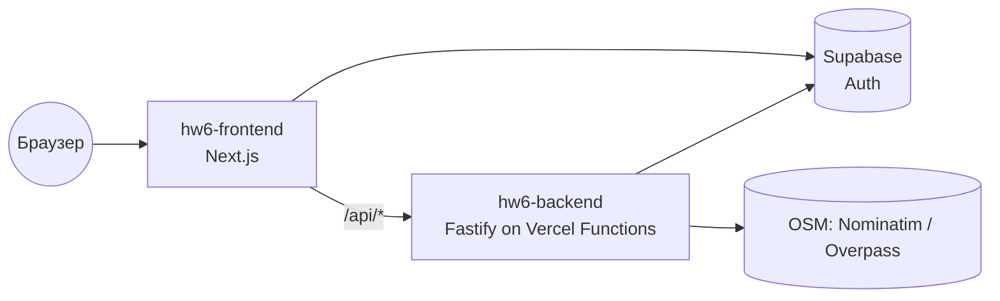

# Документация по интеграциям и деплою (HW6)

> Документ ведётся по мере выполнения шагов задания. Текущий охват: **Шаг 1 — CI/CD и деплой**.

## Технологический стек

- **Frontend**: Next.js (App Router) + React + TypeScript, Tailwind CSS + shadcn/ui. Папка `frontend/`.
- **Backend**: Fastify + TypeScript. Папка `backend/`.
- **БД / Auth**: Supabase.
- **E2E**: Playwright (корень репозитория, `npm run test:e2e`).

## Архитектура деплоя

Оба приложения деплоятся на **Vercel** (Hobby, без карты) как два отдельных проекта из одного репозитория:

| Проект | Root Directory | URL |
|--------|----------------|-----|
| `hw6-frontend` | `frontend` | https://hw6-pi-ruddy.vercel.app |
| `hw6-backend` | `backend` | https://hw6-ac72.vercel.app |

БД и аутентификация — в Supabase.

## CI/CD

### CI — GitHub Actions

Файл: `.github/workflows/ci.yml`. Триггеры: push и PR в `main`.

| Job | Шаги |
|-----|------|
| `quality` | `Prettier --check` (весь код) + `ESLint` (frontend, `next/core-web-vitals`) |
| `frontend` | `npm ci` → `npm run typecheck` → `npm run build` |
| `backend` | `npm ci` → `npm run typecheck` → `npm run build` |
| `e2e` | Playwright (chromium) с `OSM_MOCK=1`; зависит от `quality`, `frontend`, `backend`; запускается только при наличии секретов |

Проверки качества кода:
- **Форматирование** — Prettier (`npm run format:check`, конфиг `.prettierrc.json`).
- **Линтинг** — ESLint для фронтенда (`npm run lint`, `eslint-config-next/core-web-vitals`).
- **Типизация** — `tsc --noEmit` для фронта и бэка + production build.

### CD — Vercel

Автодеплой при изменении ветки `main`: Vercel пересобирает оба проекта.

> **Важно (Git Author Protection):** Vercel собирает только коммиты, автор которых — участник аккаунта Vercel. Поэтому деплой происходит при **мерже PR в `main`** (merge-коммит владельца). Прямые push от стороннего git-автора Vercel помечает как `BLOCKED`.

#### Backend на Vercel (Fastify)

Fastify запускается не как «слушающий порт» сервер (в serverless это приводит к таймауту 504), а через явный обработчик:

- `backend/src/app.ts` — `buildApp()` собирает Fastify без `listen()`.
- `backend/src/index.ts` — локальный/обычный запуск: `buildApp()` + `listen()`.
- `backend/api/index.ts` — функция Vercel: `app.ready()` + `app.server.emit("request", req, res)`.
- `backend/vercel.json` — `framework: null`, rewrite всех путей на `/api`.

#### Переменные окружения

**hw6-backend:**

| Переменная | Значение |
|------------|----------|
| `CORS_ORIGIN` | URL фронта (например `https://hw6-pi-ruddy.vercel.app`) |
| `SUPABASE_URL` | URL проекта Supabase |
| `SUPABASE_SERVICE_ROLE_KEY` | service role ключ (только backend) |
| `SUPABASE_JWKS_URL` | `https://<ref>.supabase.co/auth/v1/.well-known/jwks.json` |
| `HOST` | на Vercel выставляется в `0.0.0.0` автоматически (`process.env.VERCEL`) |

`PORT` Vercel прокидывает сам. `CORS_ORIGIN` нормализуется в коде (убирается хвостовой `/`, поддерживается список через запятую).

**hw6-frontend:**

| Переменная | Значение |
|------------|----------|
| `NEXT_PUBLIC_SUPABASE_URL` | URL проекта Supabase |
| `NEXT_PUBLIC_SUPABASE_ANON_KEY` | публичный anon-ключ |
| `NEXT_PUBLIC_BACKEND_URL` | URL бэкенда (`https://hw6-ac72.vercel.app`) |

URL бэкенда резолвится через `frontend/lib/backend-url.ts`: приоритет у `NEXT_PUBLIC_BACKEND_URL`, иначе — прод-fallback.

## Статус (Шаг 1)

- CI (GitHub Actions): jobs `frontend`, `backend`, `e2e` настроены.
- Секреты для E2E добавлены в репозиторий (Settings → Secrets and variables → Actions).
- Локальный прогон E2E: **19/19 passed** (`OSM_MOCK=1`).
- Прод задеплоен: фронт `hw6-pi-ruddy.vercel.app`, бэкенд `hw6-ac72.vercel.app`.

## Health Check

`GET https://hw6-ac72.vercel.app/api/health` → `{ "ok": true }`.

## Проверка работоспособности

- `GET /api/health` → `{ ok: true }`
- `GET /api/categories` → список категорий
- `GET /api/locations/search?q=Rome` → подсказки локаций (OSM Nominatim)
