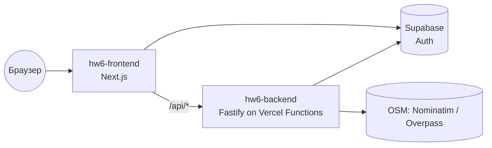
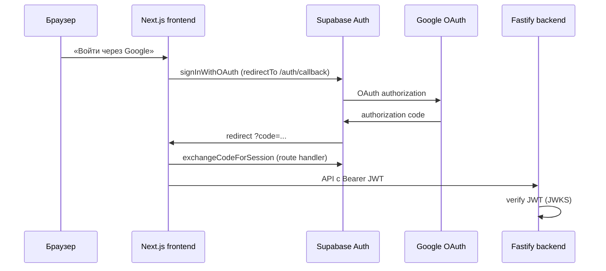

# Документация по интеграциям и деплою (HW6)

> Документ ведётся по мере выполнения шагов задания. Текущий охват: **Шаг 1 — CI/CD**, **Шаг 2 — безопасность**, **Шаг 3 — OAuth2**.

## Технологический стек

- **Frontend**: Next.js (App Router) + React + TypeScript, Tailwind CSS + shadcn/ui. Папка `frontend/`.
- **Backend**: Fastify + TypeScript. Папка `backend/`.
- **БД / Auth**: Supabase.
- **E2E**: Playwright (корень репозитория, `npm run test:e2e`).

## Архитектура деплоя

Оба приложения деплоятся на **Vercel** (Hobby, без карты) как два отдельных проекта из одного репозитория:

| Проект | Root Directory | URL |
|--------|----------------|-----|
| `hw6-frontend` | `frontend` | https://hw6-pi-ruddy.vercel.app |
| `hw6-backend` | `backend` | https://hw6-ac72.vercel.app |

БД и аутентификация — в Supabase.

## CI/CD

### CI — GitHub Actions

Файл: `.github/workflows/ci.yml`. Триггеры: push и PR в `main`.

| Job | Шаги |
|-----|------|
| `quality` | `Prettier --check` (весь код) + `ESLint` (frontend) + `npm audit --audit-level=high` (frontend, backend) |
| `frontend` | `npm ci` → `npm run typecheck` → `npm run build` |
| `backend` | `npm ci` → `npm run typecheck` → `npm run build` |
| `e2e` | Playwright (chromium) с `OSM_MOCK=1`; зависит от `quality`, `frontend`, `backend`; запускается только при наличии секретов |

Проверки качества кода:
- **Форматирование** — Prettier (`npm run format:check`, конфиг `.prettierrc.json`).
- **Линтинг** — ESLint для фронтенда (`npm run lint`, `eslint-config-next/core-web-vitals`).
- **Типизация** — `tsc --noEmit` для фронта и бэка + production build.

### CD — Vercel

Автодеплой при изменении ветки `main`: Vercel пересобирает оба проекта.

> **Важно (Git Author Protection):** Vercel собирает только коммиты, автор которых — участник аккаунта Vercel. Поэтому деплой происходит при **мерже PR в `main`** (merge-коммит владельца). Прямые push от стороннего git-автора Vercel помечает как `BLOCKED`.

#### Backend на Vercel (Fastify)

Fastify запускается не как «слушающий порт» сервер (в serverless это приводит к таймауту 504), а через явный обработчик:

- `backend/src/app.ts` — `buildApp()` собирает Fastify без `listen()`.
- `backend/src/index.ts` — локальный/обычный запуск: `buildApp()` + `listen()`.
- `backend/api/index.ts` — функция Vercel: `app.ready()` + `app.server.emit("request", req, res)`.
- `backend/vercel.json` — `framework: null`, rewrite всех путей на `/api`.

#### Переменные окружения

**hw6-backend:**

| Переменная | Значение |
|------------|----------|
| `CORS_ORIGIN` | URL фронта (например `https://hw6-pi-ruddy.vercel.app`) |
| `SUPABASE_URL` | URL проекта Supabase |
| `SUPABASE_SERVICE_ROLE_KEY` | service role ключ (только backend) |
| `SUPABASE_JWKS_URL` | `https://<ref>.supabase.co/auth/v1/.well-known/jwks.json` |
| `HOST` | на Vercel выставляется в `0.0.0.0` автоматически (`process.env.VERCEL`) |

`PORT` Vercel прокидывает сам. `CORS_ORIGIN` нормализуется в коде (убирается хвостовой `/`, поддерживается список через запятую).

**hw6-frontend:**

| Переменная | Значение |
|------------|----------|
| `NEXT_PUBLIC_SUPABASE_URL` | URL проекта Supabase |
| `NEXT_PUBLIC_SUPABASE_ANON_KEY` | публичный anon-ключ |
| `NEXT_PUBLIC_BACKEND_URL` | URL бэкенда (`https://hw6-ac72.vercel.app`) |

URL бэкенда резолвится через `frontend/lib/backend-url.ts`: приоритет у `NEXT_PUBLIC_BACKEND_URL`, иначе — прод-fallback.

## Статус (Шаг 1)

- CI (GitHub Actions): jobs `frontend`, `backend`, `e2e` настроены.
- Секреты для E2E добавлены в репозиторий (Settings → Secrets and variables → Actions).
- Локальный прогон E2E: **19/19 passed** (`OSM_MOCK=1`).
- Прод задеплоен: фронт `hw6-pi-ruddy.vercel.app`, бэкенд `hw6-ac72.vercel.app`.

## Статус (Шаг 2)

- Аудит зависимостей и кода выполнен, отчёт в `security_audit.md`.
- Исправления: headers, rate-limit, валидация, Next.js 16.2.9.
- E2E: **19/19 passed** локально.

## OAuth2 (Шаг 3)

Провайдер: **Google** через **Supabase Auth** (PKCE, state — встроены в Supabase).

### Архитектура

- **Frontend**: `signInWithOAuth`, callback `frontend/app/auth/callback/route.ts`, кнопка в диалоге входа.
- **Backend**: не обменивает code на token (это делает Supabase); проверяет выданный JWT и отдаёт профиль `GET /api/auth/me`.
- **Email/пароль** — сохранён как альтернативный способ входа.

### Настройка (один раз)

#### 1. Google Cloud Console

1. [Google Cloud Console](https://console.cloud.google.com/) → APIs & Services → Credentials → Create OAuth client ID (Web application).
2. **Authorized JavaScript origins**: `http://127.0.0.1:3000`, `https://hw6-pi-ruddy.vercel.app`.
3. **Authorized redirect URIs**: `https://zparhjgdxiipsxoijkga.supabase.co/auth/v1/callback` (URL Supabase callback, не фронтенда).
4. Скопировать **Client ID** и **Client Secret**.

#### 2. Supabase Dashboard

1. Authentication → Providers → **Google** → Enable, вставить Client ID/Secret.
2. Authentication → URL Configuration:
   - **Site URL**: `https://hw6-pi-ruddy.vercel.app`
   - **Redirect URLs** (добавить):
     - `http://127.0.0.1:3000/auth/callback`
     - `https://hw6-pi-ruddy.vercel.app/auth/callback`

Переменные Vercel для OAuth **не нужны** — ключи хранятся в Supabase. На фронте достаточно `NEXT_PUBLIC_SUPABASE_*`.

### Проверка

- Локально: вход через Google на `/catalog` → после редиректа кнопка «Выйти» с email.
- Backend: `GET /api/auth/me` с `Authorization: Bearer <access_token>` → `{ id, email, provider: "google" }`.
- Ошибки OAuth показываются в диалоге входа (`auth_error` query param).

## Статус (Шаг 3)

- Код OAuth (Google + Supabase) в репозитории.
- Для работы на проде нужна настройка Google + Supabase (см. выше) — Client ID/Secret в консоли провайдера.

## Безопасность (Шаг 2)

Полный отчёт: [`security_audit.md`](security_audit.md).

### Зависимости

- Регулярная проверка: `npm audit` в `frontend/` и `backend/`.
- CI: job `quality` падает при **high/critical** (`npm audit --audit-level=high`).
- Next.js обновлён до **16.2.9** (патчи high CVE).

### Backend (Fastify)

| Мера | Реализация |
|------|------------|
| Security headers | `@fastify/helmet` |
| Rate limiting | `@fastify/rate-limit` — 120 req/min, `/api/health` в allowlist |
| Размер тела | `bodyLimit: 256KB` |
| CORS | Явный `CORS_ORIGIN`, methods GET/POST/DELETE/OPTIONS |
| Auth | JWT через Supabase JWKS (`jose`), favorites scope по `user_id` |
| Валидация | Zod на всех маршрутах; whitelist `categoryIds` |
| XSS (данные OSM) | `externalUrl` — только http/https (`safe-url.ts`) |

### Frontend (Next.js)

| Мера | Реализация |
|------|------------|
| Security headers | CSP, `X-Frame-Options: DENY`, `X-Content-Type-Options: nosniff`, Referrer-Policy |
| XSS | React escaping; `isSafeHttpUrl` перед внешними ссылками |
| Секреты | Только `NEXT_PUBLIC_*` в браузере; service role — только backend |

### CSRF

API использует **Bearer JWT** в заголовке `Authorization`, не cookie-сессии — классический CSRF для state-changing запросов маловероятен при корректном CORS.

## Health Check

`GET https://hw6-ac72.vercel.app/api/health` → `{ "ok": true }`.

## Проверка работоспособности

- `GET /api/health` → `{ ok: true }`
- `GET /api/categories` → список категорий
- `GET /api/locations/search?q=Rome` → подсказки локаций (OSM Nominatim)
