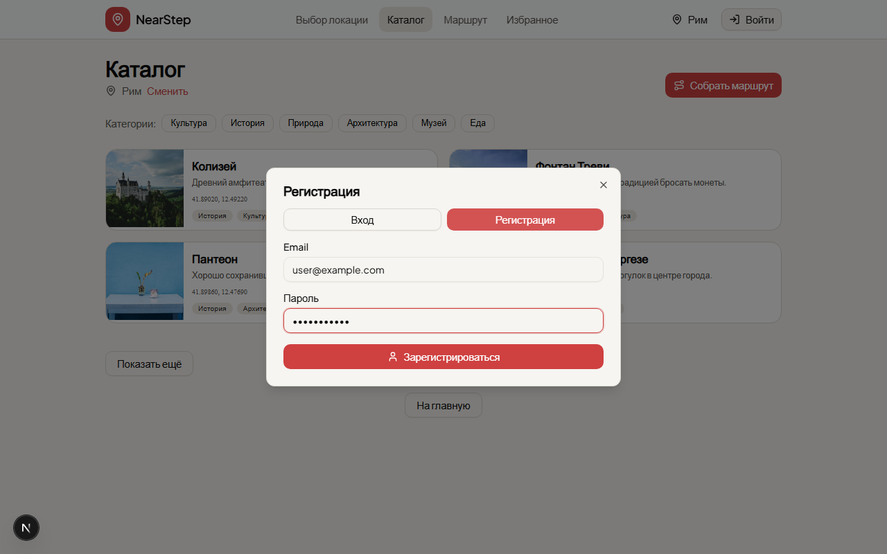

# Домашнее задание "Развертывание Backend и интеграция с Frontend"

NearStep — туристический сервис планирования прогулок с backend на Fastify + Supabase.

Документация backend: [artifacts/backend_documentation.md](artifacts/backend_documentation.md).

## Запуск

1. Клонировать репозиторий.
2. **Supabase:** создать проект → выполнить SQL из `backend/migrations/0001_init_favorites_and_provider_cache.sql` → включить Email/Password Auth. Подробнее: [развертывание](artifacts/backend_documentation.md).
3. **Backend:** `cd backend` → `cp .env.example .env` (заполнить `SUPABASE_*`, `OSM_USER_AGENT`) → `npm install` → `npm run dev`.
4. **Frontend:** `cd frontend` → `cp .env.example .env.local` (заполнить `NEXT_PUBLIC_*`) → `npm install` → `npm run dev`.
5. Открыть http://127.0.0.1:3000 — выбор города, каталог POI, построение маршрута, вход/регистрация, избранное для авторизованного пользователя.
6. Проверка API: `curl http://127.0.0.1:4000/api/health` → `{ "ok": true }`.
7. **Опционально:** из корня репозитория `npm run test:e2e` (нужны заполненные `backend/.env` и `frontend/.env.local`; для теста auth — `TEST_USER_EMAIL` / `TEST_USER_PASSWORD` в `backend/.env`).

## Быстрый старт

### 1. Supabase

Создайте проект, примените миграцию, включите Email/Password Auth — см. [развертывание](artifacts/backend_documentation.md).

### 2. Backend

```bash
cd backend
cp .env.example .env   # заполните Supabase и OSM переменные
npm install
npm run dev
```

Проверка:

```bash
curl http://127.0.0.1:4000/api/health
```

### 3. Frontend

```bash
cd frontend
cp .env.example .env.local   # заполните NEXT_PUBLIC_*
npm install
npm run dev
```

Открыть в браузере http://127.0.0.1:3000.

## Переменные окружения

### Frontend

См. [frontend/.env.example](frontend/.env.example):

| Переменная | Описание |
|------------|----------|
| `NEXT_PUBLIC_BACKEND_URL` | URL backend, например `http://127.0.0.1:4000` |
| `NEXT_PUBLIC_SUPABASE_URL` | URL проекта Supabase |
| `NEXT_PUBLIC_SUPABASE_ANON_KEY` | Публичный (anon) ключ Supabase |

### Backend (OSM)

| Переменная | Описание |
|------------|----------|
| `OSM_USER_AGENT` | **Обязательно.** User-Agent для Nominatim/Overpass (с контактом, min 3 символа) |
| `OSM_NOMINATIM_BASE_URL` | По умолчанию `https://nominatim.openstreetmap.org` |
| `OSM_OVERPASS_BASE_URL` | По умолчанию `https://overpass-api.de/api/interpreter` |
| `OSM_MOCK` | `1` — mock OSM вместо реальных запросов (см. ниже) |

Для **ручной работы с реальными данными** не задавайте `OSM_MOCK` или установите `OSM_MOCK=0`.

## Источники данных POI

Приложение работает с **реальными данными OpenStreetMap**:

| Источник | Назначение |
|----------|------------|
| **Nominatim** | Поиск города (`/api/locations/search`) |
| **Overpass** | Основной поиск POI рядом с точкой (`/api/pois`) |
| **Nominatim (fallback)** | POI по названию города, если Overpass недоступен или отвечает с ошибкой |

Поведение backend:

- Сначала запрос к **Overpass** (облегчённый запрос, только `node`).
- При сбое Overpass — **fallback на Nominatim**: поиск по шаблонам «музей {город}», «парк {город}» и т.д.
- Для fallback frontend передаёт `cityTitle` (название выбранного города).
- Ответы кэшируются в Supabase (`provider_cache`).

Идентификаторы POI:

- из Overpass: `osm:n123`, `osm:w456`, `osm:r789`;
- из Nominatim fallback: `nominatim:123456`.

Первая загрузка каталога для нового города может занять **15–30 секунд** (лимит Nominatim — 1 запрос/сек). Повторные запросы быстрее за счёт кэша.

## API endpoints

Базовый URL: `http://127.0.0.1:4000`. Все эндпоинты возвращают JSON.

| Метод | Путь | Авторизация | Описание |
| ----- | ---- | ----------- | -------- |
| GET | `/api/health` | — | Healthcheck |
| GET | `/api/categories` | — | Список категорий POI |
| GET | `/api/locations/search` | — | Поиск населённого пункта (Nominatim) |
| GET | `/api/pois` | — | POI рядом с точкой (Overpass + Nominatim fallback) |
| GET | `/api/pois/:id` | — | POI по идентификатору (`osm:*` или `nominatim:*`) |
| POST | `/api/routes/build` | — | Построение вариантов маршрута по выбранным POI |
| GET | `/api/favorites` | Bearer JWT | Список избранного текущего пользователя |
| POST | `/api/favorites` | Bearer JWT | Добавить запись (POI или маршрут) в избранное |
| DELETE | `/api/favorites/:id` | Bearer JWT | Удалить запись избранного по id |
| POST | `/api/favorites/sync` | Bearer JWT | Массовая синхронизация избранного с клиента |

### GET `/api/pois` — параметры

| Параметр | Обязательный | Описание |
|----------|--------------|----------|
| `by` | да | `nearby` |
| `lat`, `lng` | да | Центр поиска |
| `radiusMeters` | да | Радиус в метрах (50–50000) |
| `cityTitle` | нет | Название города для Nominatim fallback (рекомендуется при выборе города) |
| `categoryIds` | нет | Фильтр категорий через запятую |

Пример:

```bash
curl "http://127.0.0.1:4000/api/pois?by=nearby&lat=55.7505&lng=37.6175&radiusMeters=3000&cityTitle=%D0%9C%D0%BE%D1%81%D0%BA%D0%B2%D0%B0"
```

### Формат ошибок

```json
{ "error": { "message": "Описание ошибки", "kind": "VALIDATION" } }
```

Возможные `kind`: `VALIDATION` (400), `UPSTREAM` (502), `UNKNOWN` (401/404/500).

### Авторизация

Защищённые эндпоинты ожидают заголовок:

```
Authorization: Bearer <Supabase access_token>
```

Токен проверяется через `SUPABASE_JWKS_URL`. При отсутствии/невалидном токене — `401`.

### Примеры запросов

См. [artifacts/api_request_examples.md](artifacts/api_request_examples.md).

## Сценарий в UI

**Предусловия:** backend и frontend запущены, `OSM_USER_AGENT` заполнен, `OSM_MOCK` не включён.

1. Открыть http://127.0.0.1:3000/location → ввести город (например, **Москва** или **Рим**) → выбрать из подсказок.
2. На http://127.0.0.1:3000/catalog дождаться карточек. При первой загрузке подождать до ~30 с.
3. В блоке **«Рекомендуем»** или **«Все места»** нажать **+** у **не менее трёх** точек (счётчик «Выбрано: N»).
4. При необходимости воспользоваться **поиском** или фильтром **категорий**.
5. Нажать **«Собрать маршрут»** → на `/route/build` указать длину (например, **10** км) → выбрать **«Центр выбранной области»** → **«Построить»**.
6. На `/route/results` должны появиться **до 3 вариантов** кольцевого маршрута со списком остановок.

Если каталог пустой или ошибка «Провайдер временно недоступен» — подождать минуту и нажать **«Повторить»** (публичный Overpass иногда перегружен; сработает Nominatim fallback при наличии `cityTitle`).

## Тесты

```bash
npm run test:e2e
```

Playwright **сам поднимает** backend и frontend с `OSM_MOCK=1` (детерминированные mock-данные для Рима). Требуются заполненные `backend/.env` и `frontend/.env.local`.

> **Важно про e2e и mock-режим**
>
> - E2E-тесты специально запускаются с `OSM_MOCK=1`, чтобы прогон в CI был **стабильным и детерминированным** (без зависимости от доступности/лимитов публичных OSM-инстансов).
> - Это **не означает**, что приложение “работает только на моках”: для ручной проверки end-to-end используется сценарий из раздела **«Сценарий в UI»** с реальными OSM-данными (`OSM_MOCK` не включён, `OSM_USER_AGENT` задан).
> - Ограничение “только Рим” относится **только к mock-фикстурам** для тестов.

Mock-режим (`OSM_MOCK=1` в `backend/.env`) нужен только для ручной отладки без сети или при недоступности OSM. В mock-режиме POI доступны для **Рима** (фикстуры в `backend/src/providers/osm/mock-data.ts`).

## Скриншот



## Промпты

Промпты для поэтапной разработки с Cursor AI: [artifacts/prompts/](artifacts/prompts/).
